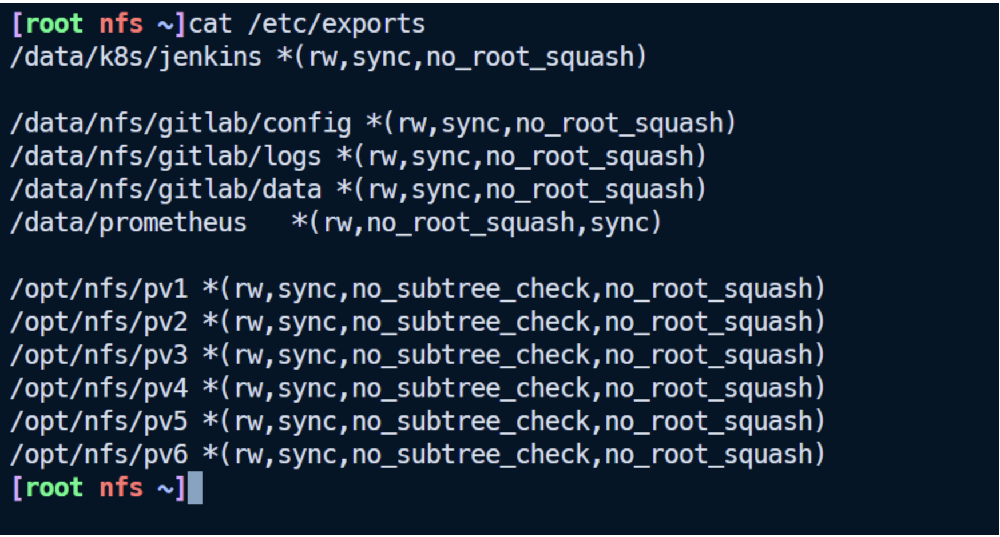

# k8s部署redis集群

一般来说，REDIS部署有三种模式。

1. 单实例模式，一般用于测试环境。
2. 哨兵模式
3. 集群模式

后两者用于生产部署

总的来说，`集群模式`明显优于`哨兵模式`

## 前置准备

### 一、nfs安装

- nfs---------服务端

```
hostname -I | awk '{print $1}'
```


1.配置（需要共享的文件夹）

```
vi /etc/exports
/opt/nfs/pv1 *(rw,sync,no_subtree_check,no_root_squash)
/opt/nfs/pv2 *(rw,sync,no_subtree_check,no_root_squash)
/opt/nfs/pv3 *(rw,sync,no_subtree_check,no_root_squash)
/opt/nfs/pv4 *(rw,sync,no_subtree_check,no_root_squash)
/opt/nfs/pv5 *(rw,sync,no_subtree_check,no_root_squash)
/opt/nfs/pv6 *(rw,sync,no_subtree_check,no_root_squash)
```



2.创建文件夹

```
mkdir -p /opt/nfs/pv{1..6}
```


3.更新配置并重启nfs服务

```
exportfs -r  #更新配置
systemctl restart nfs-server
```


4.验证-------k8s集群

```
yum -y install nfs-utils
```


````
showmount -e 192.168.13.235         
````


> 这里说一下，为什么要安装nfs？

是为了下面创建SC，PV做准备，PV需要使用nfs服务器。

### 二、SC、PV 创建

#### 2.1创建SC

StorageClass：简称sc，存储类，是k8s平台为存储提供商提供存储接入的一种声明。通过sc和相应的存储插件(csi)为容器应用提供持久存储卷的能力。

vi redis-sc.yaml

```yaml
apiVersion: storage.k8s.io/v1     # API 版本，指定使用 storage.k8s.io 组的 v1 版本
kind: StorageClass       # 资源类型，这里定义的是 StorageClass（存储类）
metadata:          # 元数据，用于标识该资源
  name: redis-sc  # StorageClass 的名称，后续创建 PVC 时需要引用此名称
# 存储供应者配置，指定使用哪个存储插件提供存储服务
provisioner: nfs-storage  # 存储插件的名称（需提前部署对应的 NFS 存储插件，如 nfs-subdir-external-provisioner），用于自动创建 PV
```


执行创建sc：

```
kubectl apply -f redis-sc.yaml
```


#### 2.2创建PV

PersistentVolume简称pv，持久化存储，是k8s为云原生应用提供一种拥有独立生命周期的、用户可管理的存储的抽象设计。

vi redis-pv.yaml

```shell
apiVersion: v1      # API版本，使用v1版本的核心API
kind: PersistentVolume     # 资源类型，定义为PersistentVolume（持久卷）
metadata:        # 元数据信息
  name: nfs-pv1  # 第一个PV的名称，唯一标识
spec:          # PV的具体规格配置
  storageClassName: redis-sc  # 关联的存储类名称，需与StorageClass的name一致
  capacity:  # 存储容量配置
    storage: 200M  # 该PV的存储空间为200MB
  accessModes:  # 访问模式配置
    - ReadWriteMany  # 支持多节点同时读写（ReadWriteMany）
  nfs:  # 存储类型为NFS
    server: 192.168.13.235  # NFS服务器的IP地址
    path: "/opt/nfs/pv1"  # NFS服务器上对应的共享目录路径

---  # 分隔符，用于在一个文件中定义多个资源
# 第二个PV定义，与第一个结构相同
apiVersion: v1
kind: PersistentVolume
metadata:
  name: nfs-pv2  # 第二个PV的名称
spec:
  storageClassName: redis-sc  # 关联同一个存储类
  capacity:
    storage: 200M  # 同样200MB容量
  accessModes:
    - ReadWriteMany  # 相同访问模式
  nfs:
    server: 192.168.13.235  # 同一个NFS服务器
    path: "/opt/nfs/pv2"  # 对应NFS的第二个共享目录

---
# 第三个PV定义
apiVersion: v1
kind: PersistentVolume
metadata:
  name: nfs-pv3  # 第三个PV的名称
spec:
  storageClassName: redis-sc
  capacity:
    storage: 200M
  accessModes:
    - ReadWriteMany
  nfs:
    server: 192.168.13.235
    path: "/opt/nfs/pv3"  # 第三个共享目录

---
# 第四个PV定义
apiVersion: v1
kind: PersistentVolume
metadata:
  name: nfs-pv4  # 第四个PV的名称
spec:
  storageClassName: redis-sc
  capacity:
    storage: 200M
  accessModes:
    - ReadWriteMany
  nfs:
    server: 192.168.13.235
    path: "/opt/nfs/pv4"  # 第四个共享目录

---
# 第五个PV定义
apiVersion: v1
kind: PersistentVolume
metadata:
  name: nfs-pv5  # 第五个PV的名称
spec:
  storageClassName: redis-sc
  capacity:
    storage: 200M
  accessModes:
    - ReadWriteMany
  nfs:
    server: 192.168.13.235
    path: "/opt/nfs/pv5"  # 第五个共享目录

---
# 第六个PV定义
apiVersion: v1
kind: PersistentVolume
metadata:
  name: nfs-pv6  # 第六个PV的名称
spec:
  storageClassName: redis-sc
  capacity:
    storage: 200M
  accessModes:
    - ReadWriteMany
  nfs:
    server: 192.168.13.235
    path: "/opt/nfs/pv6"  # 第六个共享目录
```


名称为`nfs-pv1`，对应的storageClassName为`redis-sc`，capacity容器200M，accessModes访问模式可被多节点读写

对应nfs服务器`192.168.13.235，对应文件夹路径`/opt/nfs/pv1`（对应上面安装nfs服务器）

以此类推，我们创建6个pv......

执行创建sc：

```
kubectl apply -f redis-pv.yaml
```


通过kubectl查看：

```
kubectl get sc
kubectl get pv
```


这里说一下，为什么要创建SC，PV？

因为redis集群，最终需要对应的文件有，`redis.conf`、`nodes.conf`、`data`

由此可见，这些文件每个节点，都得对应有自己得文件夹。

当然`redis.conf`可以是一个相同得，其他两个，就肯定是不一样得。

如果使用挂载文件夹即是 `Volume` 的情况部署一个pod，很明显，是不能满足的。

当然，你部署多个不一样的pod，也是可以做到，但是就得写6个部署yaml文件，后期维护也很复杂。

最好的效果是，写一个部署yaml文件，然后有6个replicas副本，就对应了我们redis集群（三主三从）。

那一个pod，再使用`Volume`挂载文件夹，这个只能是一个文件夹，是无法做到6个pod对应不同的文件夹。

所以这里，就引出了`SC`、`PV`了。

使用`SC`、`PV`就可以实现，这6个pod启动，就对应上我们创建的6个`PV`，那就实现了`redis.conf`、`nodes.conf`、`data`，这三个文件，存放的路径，就是不一样的路径了。

哈哈，说了，那么多，不知道，大家明不明白，不明白的可以继续往下看，或者自己部署实操一下，估计你就能明白，为啥要这么干了？


### 三、redis集群搭建

#### 3.1创建headless服务

Headless service是StatefulSet实现稳定网络标识的基础。

vi redis-hs.yaml

```
---  # YAML文件分隔符，用于在单个文件中区分多个Kubernetes资源定义
apiVersion: v1  # 指定该资源使用的Kubernetes API版本，v1是核心API组的稳定版本
kind: Service  # 定义资源类型为Service，用于在K8s集群内暴露Pod网络访问
metadata:  # 资源的元数据，用于标识和描述Service
  labels:  # 给Service添加的标签，用于分类和筛选（键值对形式）
    k8s.kuboard.cn/layer: db  # 自定义标签1：标识Service所属层级为数据库（db）
    k8s.kuboard.cn/name: redis  # 自定义标签2：标识Service关联的应用名为redis
  name: redis-hs  # Service的名称，在所属命名空间内唯一，后续可通过该名称访问
  namespace: redis  # 指定Service所在的命名空间，限制资源访问范围（此处为redis命名空间）
spec:  # Service的核心配置规格，定义其工作方式
  ports:  # 配置Service暴露的端口映射规则（数组形式，可定义多个端口）
    - name: nnbary  # 端口的名称（自定义，需唯一），用于区分同一Service的不同端口
      port: 6379  # Service对外暴露的端口，集群内其他Pod通过该端口访问Service
      protocol: TCP  # 端口使用的网络协议，此处为TCP（Redis默认使用TCP协议）
      targetPort: 6379  # 端口映射的目标端口，即后端Pod实际监听的端口（与Redis服务端口一致）
  selector:  # 标签选择器，用于指定Service要关联的Pod
    k8s.kuboard.cn/layer: db  # 匹配带有该标签的Pod
    k8s.kuboard.cn/name: redis  # 匹配带有该标签的Pod（需同时满足两个标签，实现精确筛选）
  clusterIP: None  # 设定Service的集群IP为None，表明这是一个Headless Service（无头服务）
                   # 特点：不分配固定集群IP，通过Service名称直接解析到后端Pod的IP，适合StatefulSet（如Redis集群）场景
```


在执行 `kubectl apply -f redis-hs.yaml` 前，先运行以下命令创建 `redis` 命名空间：

````
kubectl create namespace redis
````


执行：

```
kubectl apply -f redis-hs.yaml
```


网络访问：pod名称.headless名称.namespace名称.svc.cluster.local

即：pod名称.redis-hs.redis.svc.cluster.local

#### 3.2创建redis对应pod集群

创建好Headless service后，就可以利用StatefulSet创建Redis 集群节点，这也是本文的核心内容。

vi redis.yaml

```yaml
# API版本，指定使用apps组的v1版本（StatefulSet属于该版本，稳定可用）
apiVersion: apps/v1
# 资源类型，定义为StatefulSet（有状态集合，用于部署Redis集群这类需要稳定名称、存储的应用）
kind: StatefulSet
# 资源元数据，用于标识和描述StatefulSet
metadata:
  name: redis  # StatefulSet的名称，在所属命名空间内唯一
  namespace: redis  # 指定StatefulSet所在的命名空间（需提前创建redis命名空间）
  labels:  # 给StatefulSet添加的标签，用于分类、筛选或关联其他资源
    k8s.kuboard.cn/layer: db  # 自定义标签1：标识资源所属层级为数据库（db）
    k8s.kuboard.cn/name: redis  # 自定义标签2：标识资源关联的应用名为redis
# StatefulSet的核心配置规格，定义其运行规则
spec:
  replicas: 6  # 配置副本数量，将部署6个Redis节点
  selector:  # 标签选择器，用于关联要管理的Pod（需与Pod模板的labels一致）
    matchLabels:  # 匹配的标签条件（需同时满足两个标签）
      k8s.kuboard.cn/layer: db
      k8s.kuboard.cn/name: redis
  serviceName: redis  # 关联的Headless Service名称（为Pod提供稳定网络标识，需提前创建该Service）
  template:  # Pod模板，定义每个副本Pod的具体配置
    metadata:
      labels:  # Pod的标签（需与上面的selector.matchLabels完全一致，确保被StatefulSet管理）
        k8s.kuboard.cn/layer: db
        k8s.kuboard.cn/name: redis
    spec:  # Pod的运行规格
      terminationGracePeriodSeconds: 20  # Pod终止前的优雅等待时间（20秒），避免强制关闭导致数据丢失
      containers:  # 容器配置列表（StatefulSet的Pod包含一个Redis容器）
        - name: redis  # 容器名称，在Pod内唯一
          image: docker.io/library/redis:8.0.3  # 容器使用的Redis镜像（来自Docker官方仓库，版本8.0.3）
          ports:  # 容器需要暴露的端口
            - name: redis  # 端口名称（自定义，标识Redis服务端口）
              containerPort: 6379  # 容器内部监听的端口（Redis默认服务端口）
              protocol: "TCP"  # 端口使用的网络协议（Redis基于TCP通信）
            - name: cluster  # 端口名称（自定义，标识Redis集群通信端口）
              containerPort: 16379  # 容器内部监听的端口（Redis集群gossip协议通信端口）
              protocol: "TCP"  # 端口使用的网络协议
          volumeMounts:  # 容器内的目录挂载配置（将外部卷挂载到容器内部路径）
            - name: "redis-conf"  # 挂载的卷名称（需与下面volumes中的name一致）
              mountPath: "/etc/redis/redis.conf"  # 容器内的挂载路径（Redis配置文件存放路径）
            - name: "redis-data"  # 挂载的卷名称（需与volumeClaimTemplates中的name一致）
              mountPath: "/data"  # 容器内的挂载路径（Redis数据存储目录）
      volumes:  # Pod使用的静态卷配置（此处为hostPath类型，关联宿主机文件）
        - name: "redis-conf"  # 卷名称（与上面volumeMounts中的"redis-conf"对应）
          hostPath:  # 卷类型为hostPath（将宿主机的文件/目录挂载到Pod）
            path: "/opt/redis/conf/redis.conf"  # 宿主机上的文件路径（Redis配置文件所在位置）
            type: FileOrCreate  # 卷类型参数：若宿主机上该文件不存在，则自动创建空文件
  volumeClaimTemplates:  # 存储卷声明模板（动态生成PVC，为每个Pod绑定独立存储）
    - metadata:
        name: redis-data  # PVC的名称（与上面volumeMounts中的"redis-data"对应）
      spec:  # PVC的配置规格（向存储类申请存储资源）
        accessModes: [ "ReadWriteMany" ]  # 存储访问模式：多节点可同时读写（适合Redis集群共享数据场景）
        resources:
          requests:  # 存储资源请求（向存储类申请的最小存储容量）
            storage: 200M  # 请求200MB存储空间
        storageClassName: redis-sc  # 关联的存储类名称（需提前创建名为redis-sc的StorageClass，用于动态分配PV）
```

挂载的文件：宿主机的`/opt/redis/conf/redis.conf`到redis容器的`/etc/redis/redis.conf`（redis.conf配置文件如下所示）

PVC存储卷声明模板`volumeClaimTemplates`，指定了名称为`redis-sc`的SC（storageClassName）

由于之前SC绑定了PV，所以这里的PVC和PV，就能一 一对应绑定上了。

PV和PVC的关系，是一 一绑定的。如果这里不指定SC，那就会导致，PVC绑定PV，是一个混乱的过程，随机绑定PV了。

vim /opt/redis/conf/redis.conf

```yaml
# API版本，指定使用apps资源组的v1版本，StatefulSet属于该版本，是稳定可用的官方版本
apiVersion: apps/v1
# 资源类型，定义为StatefulSet（有状态集合），专门用于部署Redis集群这类需要稳定名称、固定存储、有序启停的有状态应用
kind: StatefulSet
# 资源的元数据信息，用于标识和描述当前StatefulSet
metadata:
  name: redis  # StatefulSet的名称，在其所属命名空间内必须唯一，用于后续管理和引用
  namespace: redis  # 指定该StatefulSet所在的命名空间（需提前通过kubectl create namespace redis创建），实现资源隔离
  labels:  # 为StatefulSet添加自定义标签，用于分类、筛选资源或关联其他K8s资源（如Service）
    k8s.kuboard.cn/layer: db  # 自定义标签1：标识该资源所属的业务层级为数据库（db）
    k8s.kuboard.cn/name: redis  # 自定义标签2：标识该资源关联的应用名称为redis
# StatefulSet的核心配置规格，定义其运行规则和管理的Pod属性
spec:
  replicas: 6  # 配置Pod副本数量，将在集群中部署6个Redis节点（满足Redis集群3主3从的最小架构需求）
  selector:  # 标签选择器，用于指定该StatefulSet要管理的Pod范围（需与Pod模板的labels完全匹配）
    matchLabels:  # 匹配条件：只有同时带有以下两个标签的Pod，才会被该StatefulSet管理
      k8s.kuboard.cn/layer: db
      k8s.kuboard.cn/name: redis
  serviceName: redis-hs  # 关联的Headless Service（无头服务）名称，为StatefulSet的每个Pod提供稳定的网络标识（如redis-0.redis.redis.svc.cluster.local），需提前创建该Service
  template:  # Pod模板，定义每个Redis副本Pod的具体配置（所有副本均基于此模板创建）
    metadata:
      labels:  # Pod的标签，需与上面的selector.matchLabels完全一致，确保被StatefulSet识别和管理
        k8s.kuboard.cn/layer: db
        k8s.kuboard.cn/name: redis
    spec:  # Pod的运行规格，定义容器、挂载、资源等配置
      terminationGracePeriodSeconds: 20  # Pod终止前的优雅等待时间（20秒），避免Redis在数据未同步完成时被强制关闭，减少数据丢失风险
      containers:  # 容器配置列表，当前Pod仅包含一个Redis容器
        - name: redis  # 容器名称，在Pod内唯一，用于标识和管理该容器
          image: docker.io/library/redis:8.0.3  # 容器使用的Redis镜像，来源于Docker官方仓库，版本为8.0.3（确保镜像版本与配置兼容）
          command: ["/usr/local/bin/redis-server", "/etc/redis/redis.conf"]  # Redis容器的启动命令，明确指定加载自定义配置文件（而非默认配置），确保密码、集群等配置生效
          ports:  # 容器需要暴露的端口（用于集群内部通信和外部访问）
            - name: redis  # 端口名称（自定义，用于区分不同端口用途），标识Redis服务端口
              containerPort: 6379  # 容器内部监听的端口，Redis默认服务端口（客户端连接端口）
              protocol: "TCP"  # 端口使用的网络协议，Redis基于TCP进行数据通信
            - name: cluster  # 端口名称，标识Redis集群通信端口
              containerPort: 16379  # 容器内部监听的端口，Redis集群gossip协议通信端口（用于节点间状态同步、故障检测）
              protocol: "TCP"  # 端口使用的网络协议，集群通信同样基于TCP
          volumeMounts:  # 容器内的目录挂载配置，将外部卷（volumes或PVC）挂载到容器内部指定路径
            - name: "redis-conf"  # 挂载的卷名称，需与下面volumes中的"redis-conf"名称一致
              mountPath: "/etc/redis/redis.conf"  # 容器内的挂载路径，Redis配置文件在容器内的存放位置（与启动命令中的配置路径对应）
            - name: "redis-data"  # 挂载的卷名称，需与下面volumeClaimTemplates中的"redis-data"名称一致
              mountPath: "/data"  # 容器内的挂载路径，Redis数据存储目录（持久化数据存放位置）
      volumes:  # Pod使用的静态卷配置，此处为hostPath类型（挂载宿主机文件）
        - name: "redis-conf"  # 卷名称，与上面volumeMounts中的"redis-conf"对应
          hostPath:  # 卷类型为hostPath，将宿主机上的文件或目录挂载到Pod内（注意：该卷仅在当前调度节点生效，需确保所有节点有相同文件）
            path: "/opt/redis/conf/redis.conf"  # 宿主机上Redis配置文件的路径（需提前在所有节点创建该文件并配置密码、集群参数）
            type: FileOrCreate  # 卷类型参数：若宿主机上该文件不存在，则自动创建空文件（避免因文件缺失导致挂载失败）
  volumeClaimTemplates:  # 存储卷声明模板（PVC模板），为StatefulSet的每个Pod动态创建独立的PVC（与PV绑定，实现数据持久化）
    - metadata:
        name: redis-data  # PVC的名称，与上面volumeMounts中的"redis-data"对应
      spec:  # PVC的配置规格，定义存储需求（向存储类申请资源）
        accessModes: [ "ReadWriteMany" ]  # 存储访问模式：多节点可同时读写（RWX），适合Redis集群主从节点共享数据或跨节点故障转移场景
        resources:
          requests:  # 存储资源请求，向存储类申请的最小存储容量
            storage: 200M  # 申请200MB存储空间（可根据实际数据量调整）
        storageClassName: redis-sc  # 关联的存储类名称（需提前创建名为redis-sc的StorageClass），由存储类自动分配匹配的PV（如NFS类型PV）
```


把/opt/redis/conf/redis.conf   发送每一个工作节点

```
scp /opt/redis/conf/redis.conf  node1:/opt/redis/conf
scp /opt/redis/conf/redis.conf  node2:/opt/redis/conf
```


执行：

```
kubectl apply -f redis.yaml
```


由上操作，我们已经创建好redis的6个副本了。

查看redis的pod对应的ip

````
kubectl  get pod -n redis -o wide
````


```
kubectl get -n redis statefulset
```


进入到redis-0容器

````
kubectl exec -it redis-0  -n redis -- /bin/bash
````


\# 创建master节点（redis-0、redis-2、redis-4）

```
redis-cli --cluster create 10.244.2.196:6379 10.244.1.195:6379 10.244.1.196:6379 -a 123456
```


注意上面的master节点，会生成对应节点id：86419287154c8552decfc9a1f95dd333b89373c2 27397d7dfbc1459b90db58f1d320f9de4fb36b98 
713e9929357759de29ae8e62642c180f67ed2e3a ，用于创建slave节点。

查看主节点 ID

```
redis-cli -a 123456 cluster nodes
```


### 主节点 IP

- `10.244.2.196`（redis-0）
- `10.244.1.195`（redis-2）
- `10.244.1.196`（redis-4）

### 确认待添加的从节点 IP

- `10.244.1.194`（redis-1）
- `10.244.2.197`（redis-3）
- `10.244.2.198`（redis-5）

#### 1. 将 `redis-1`（IP：10.244.1.194）设为 主 1（ID：3c8ec7f9af68710ab2b4f42b91dc66168ad6a19f）的从节点

```
redis-cli --cluster add-node 10.244.1.194:6379 10.244.2.196:6379 --cluster-slave --cluster-master-id 3c8ec7f9af68710ab2b4f42b91dc66168ad6a19f -a 123456
```


#### 2. 将 `redis-3`（IP：10.244.2.197）设为 主 2（ID：dff358a1151c07d22da2ff43092e03cf6644bf85）的从节点

```
redis-cli --cluster add-node 10.244.2.197:6379 10.244.2.196:6379 --cluster-slave --cluster-master-id dff358a1151c07d22da2ff43092e03cf6644bf85 -a 123456
```


#### 3. 将 `redis-5`（IP：10.244.2.198）设为 主 3（ID：95211356e7f4e41002f1f123ec9db2d9909fab40）的从节点

```
redis-cli --cluster add-node 10.244.2.198:6379 10.244.2.196:6379 --cluster-slave --cluster-master-id 95211356e7f4e41002f1f123ec9db2d9909fab40 -a 123456
```


显示以下信息，即为添加成功：

[OK] All nodes agree about slots configuration.

[OK] All 16384 slots covered.

[OK] New node added correctly.

坑：

一开始是想用headless的域名创建redis集群的，这样节点重启后就不需要更新ip，但是redis不支持使用域名，所以只能绕了一圈又回到固定ip的方法，和容器环境很不协调。


执行以下命令查看集群节点状态：

```
redis-cli -a 123456 cluster nodes
```


可以看到3个master，3个slave节点，都是`connected`状态。

### 最终确认集群健康状态

```
redis-cli -a 123456 cluster info
```


注意：

现在进入集群中的任意一个Pod中都可以访问Redis服务，前面我们创建了一个headless类型的Service，kubernetes集群会为该服务分配一个DNS记录，格式为:`$(pod.name)`.`$(headless server.name)`.`${namespace}`.`svc.cluster.local`，每次访问该服务名时，将会直接进入到redis的节点上。`svc.cluster.local`可省略。 例如：

```
redis-cli -c -a 123456 -h redis-0.redis-hs.redis -p 6379
```


- get，set验证

```shell
kubectl exec -it redis-0  -n redis -- /bin/bash
root@redis-0:/data# redis-cli -c -a 123456
127.0.0.1:6379> set name zs
-> Redirected to slot [5798] located at 10.244.1.195:6379
OK
10.244.1.195:6379> set age 19
-> Redirected to slot [741] located at 10.244.2.196:6379
OK
10.244.2.196:6379> set sex 1
OK
10.244.2.196:6379> exit
root@redis-0:/data# exit
exit

kubectl exec -it redis-1  -n redis -- /bin/bash
root@redis-1:/data# redis-cli -c -a 123456
127.0.0.1:6379> get name
-> Redirected to slot [5798] located at 10.244.1.195:6379
"zs"
10.244.1.195:6379> get age
-> Redirected to slot [741] located at 10.244.2.196:6379
"19"
10.244.2.196:6379> get sex
"1"
```


master节点进行set操作，slave节点复制。`主从复制`

### 1.3重启pod,验证集群

redis-2未重启之前

```
cluster nodes
```


重启redis-2

```
kubectl delete pod redis-2 -n redis
```


redis-2重启之后

````
kubectl exec -it redis-0  -n redis -- /bin/bash
root@redis-0:/data# redis-cli -c -a 123456
127.0.0.1:6379> cluster nodes
````


可以看到重启后的，redis-1节点，虽然ip变了，但是redis集群，还是可以识别到新的ip，集群还是正常的。

10.244.1.195 ---> 10.244.1.197

### 1.4创建Service服务

前面我们创建了用于实现StatefulSet的Headless Service，但该Service没有Cluster Ip，因此不能用于外界访问。所以，我们还需要创建一个Service，专用于为Redis集群提供访问和负载均衡。

这里可以使用`ClusterIP`，`NodePort`。这里，我使用的是`NodePort`。

vi redis-ss.yaml

```yaml
# 1. API 版本：指定使用的 Kubernetes API 版本，v1 是 Service 资源的稳定版本
apiVersion: v1
# 2. 资源类型：声明该 YAML 定义的是 Service 资源（用于暴露 Pod 网络访问）
kind: Service
# 3. metadata：Service 的元数据，包含标签、名称、所属命名空间等描述信息
metadata:
  # 3.1 labels：给 Service 打标签，用于 Kubernetes 资源筛选（如 kubectl 按标签查询）
  labels:
    k8s.kuboard.cn/layer: db  # 自定义标签：标识 Service 所属“层级”为数据库（db）
    k8s.kuboard.cn/name: redis # 自定义标签：标识 Service 关联的“名称”为 redis（与 Redis Pod 标签对应）
  # 3.2 name：Service 的名称，在 redis 命名空间内唯一，用于后续访问（如 redis-ss.redis.svc.cluster.local）
  name: redis-ss
  # 3.3 namespace：Service 所属的命名空间，与 Redis StatefulSet 保持一致（均为 redis），实现资源隔离
  namespace: redis
# 4. spec：Service 的核心配置，定义如何暴露 Pod 以及访问规则
spec:
  # 4.1 ports：端口映射配置，定义 Service 对外暴露的端口与 Pod 内部端口的对应关系（可配置多个端口）
  ports:
    # 4.1.1 单个端口映射规则（此处仅配置 Redis 主端口 6379）
    - name: imdgss  # 端口的名称（自定义，仅用于标识，如“imdgss”可理解为“缓存服务端口”）
      port: 6379    # Service 自身在集群内部暴露的端口（集群内其他 Pod 访问时用这个端口）
      protocol: TCP # 协议类型，Redis 基于 TCP 通信，固定为 TCP
      targetPort: 6379 # 目标端口：指向 Redis Pod 内部实际监听的端口（必须与 Redis 配置的端口一致）
      nodePort: 30379    # NodePort 类型的关键配置：集群节点（如 node1、node2）对外暴露的端口
                      # 外部访问时用“节点IP:30379 ”即可访问 Redis（如 192.168.1.101:30379 ）
  # 4.2 selector：Service 的“核心匹配规则”，通过标签找到要暴露的 Pod
  # 作用：将 Service 与 Redis Pod 绑定，所有符合标签的 Pod 都会被纳入该 Service 的访问范围
  selector:
    k8s.kuboard.cn/layer: db  # 匹配标签：仅关联“层级为 db”的 Pod
    k8s.kuboard.cn/name: redis # 匹配标签：仅关联“名称为 redis”的 Pod（需与 Redis StatefulSet 的 Pod 标签完全一致）
  # 4.3 type：Service 的类型，NodePort 表示“通过集群节点的固定端口暴露服务”
  # 特点：会在每个集群节点上开放一个固定端口（即上面的 nodePort:6379），外部可通过节点 IP + 该端口访问
  type: NodePort
```

```
kubectl apply -f redis-ss.yaml 
```


创建名称为：`redis-ss`的服务。

在K8S集群中暴露6379端口，并且会对`labels name`为`k8s.kuboard.cn/name: redis`的pod进行负载均衡。

然后在K8S集群中，就可以通过`redis-ss:6379`，对redis集群进行访问。

````
kubectl get service -n redis
````


**安装客户端**

```
yum install -y redis 
```


```
kubectl get pod -o wide -n redis
```


```
redis-cli -h 192.168.13.248 -p 30379 -a 123456 -c
info replication
 get name
```


```
redis-cli -h 192.168.13.249 -p 30379 -a 123456 -c
info replication
set hell word
```


### 1.6相关疑问分析

至此，大家可能会疑惑，那为什么没有使用稳定的标志，Redis Pod也能正常进行故障转移呢？这涉及了Redis本身的机制。因为，Redis集群中每个节点都有自己的NodeId（保存在自动生成的nodes.conf中），并且该NodeId不会随着IP的变化和变化，这其实也是一种固定的网络标志。也就是说，就算某个Redis Pod重启了，该Pod依然会加载保存的NodeId来维持自己的身份。我们可以在NFS上查看redis-0的nodes.conf文件：

```
cat /opt/nfs/pv1/nodes.conf
```


如上，第一列为NodeId，稳定不变；第二列为IP和端口信息，可能会改变。

这里，我们介绍NodeId的两种使用场景：

当某个Slave Pod断线重连后IP改变，但是Master发现其NodeId依旧， 就认为该Slave还是之前的Slave。

当某个Master Pod下线后，集群在其Slave中选举重新的Master。待旧Master上线后，集群发现其NodeId依旧，会让旧Master变成新Master的slave。

对于这两种场景，大家有兴趣的话还可以自行测试，注意要观察Redis的日志。